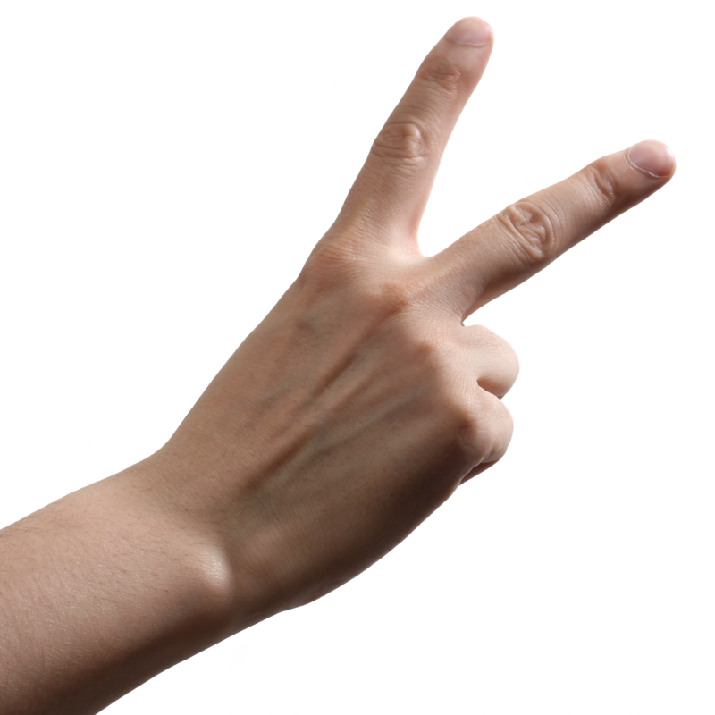

<!DOCTYPE html>
<html lang="de">

<head>
    
</head>

<body>
    
Schere.png, Stein.jpg, Papyrus.gif! 

    

        <h3>ComputerSeite</h3>
        
        
        
        <button style="margin-top: 90%;" onclick="neueRunde()">Runde starten</button>

    

    

        
0

    

    

        
0

    

    

        <h3>Spielerseite</h3>

    

    

        
0

    

    

        
TEST

    

    

        

    

    

        
123

    

    

        
321

    

    
    

</body>

</html>